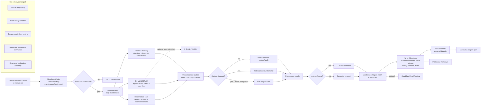

# MaintainerBot Architecture

## Architecture diagram



## Core Flue workflow

```txt
.flue/workflows/daily-maintenance.ts
```

The workflow:

1. Validates the protected webhook secret.
2. Loads durable memory from R2.
3. Scans GitHub repositories, issues, and PRs.
4. Builds deterministic recommendations with stable fingerprints.
5. Builds per-project context, including repo health, issues, PRs, deterministic findings, and root TODO files.
6. Calls an LLM to synthesize the final handoff when model credentials are configured; otherwise emits a context-only surface audit.
7. Writes the living status page, latest aliases, audit ledgers, and historic reports to R2.
8. Optionally sends email via Cloudflare Email Routing, though email is not a current priority.

The deployed daily workflow is read-only with respect to GitHub: it reads metadata and writes only MaintainerBot-owned R2 objects.

## Storage

Cloudflare R2 is the durable storage layer.

Primary latest status objects:

```txt
MaintainerBotOut.md
MaintainerBotOut.json
```

Latest aliases:

```txt
reports/daily-maintenance-latest.md
reports/daily-maintenance-latest.json
```

Historic snapshots:

```txt
reports/history/YYYY-MM-DD/daily-maintenance.md
reports/history/YYYY-MM-DD/daily-maintenance.json
```

## Runtime

The daily workflow uses Flue's default virtual sandbox for local scratch files. GitHub API calls happen from trusted runtime code with secrets in env, not from prompts.

CLI-only workflows are used for heavyweight read-only checks. `deep-verify` clones changed repos into temporary local sandboxes, runs safe verification commands, and summarizes evidence without mutating GitHub.

## Context bundles

MaintainerBot separates durable memory, cheap discovery, context bundles, and LLM outputs. Each run stores an account-level run context bundle. Project context bundles are rebuilt only when a cheap project state fingerprint changes. Stored context bundles enable local replay and multi-agent/model comparison without re-running GitHub loaders.

See:

```txt
docs/CONTEXT.md
```

## LLM context

With LLM credentials, the workflow calls an LLM to synthesize the daily handoff from deterministic surface-audit facts. Without LLM credentials, it still builds/reuses context bundles and publishes a degraded context-only report. It computes state/input hashes for each project and only sends changed project bundles to per-project LLM audits when a model is configured. Each context includes repository metadata, health signals, open TODOs from root TODO files, open issues, open PRs, and deterministic findings. Secrets are not included.

LLM audit history is stored in R2:

```txt
audits/index.json
audits/projects/<owner>__<repo>/latest.json
audits/projects/<owner>__<repo>/history/<timestamp>.json
```

## Model routing

With provider secrets, MaintainerBot can use Anthropic, OpenAI, or OpenRouter models. With `ANTHROPIC_API_KEY`, it can also use:

```txt
anthropic/claude-haiku-4-5
```

If `CLOUDFLARE_ACCOUNT_ID` and `CF_AI_GATEWAY_ID` are also configured, Anthropic traffic is routed through Cloudflare AI Gateway.

## Future remote sandbox

A remote sandbox will be useful when MaintainerBot needs real git clones, dependency installation, and test execution. Until then, API-based scanning keeps the deployed Worker fast and cheap.
